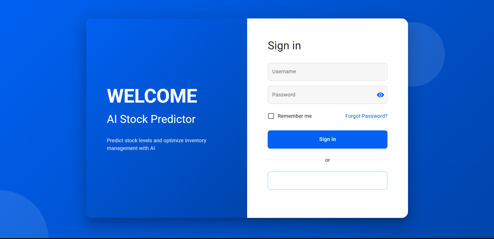
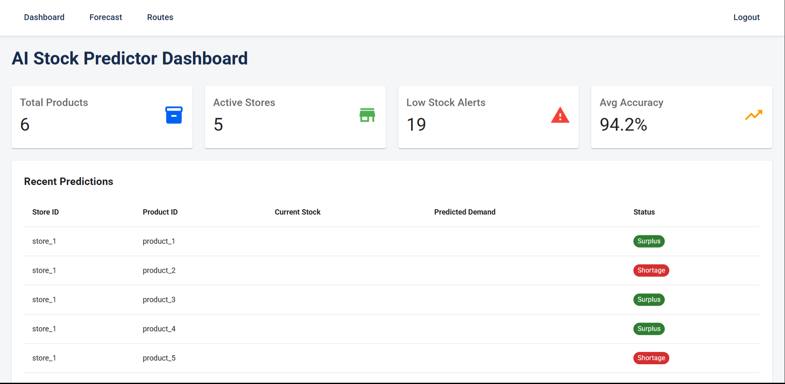
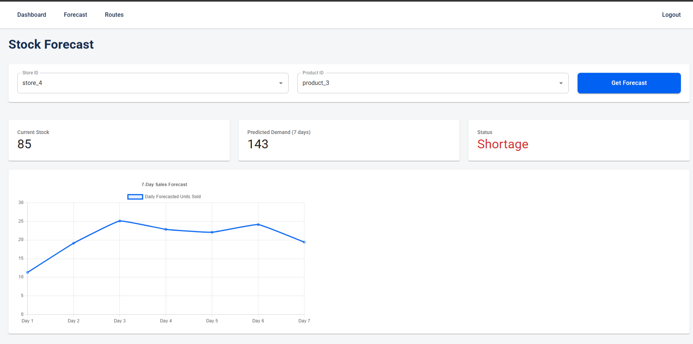
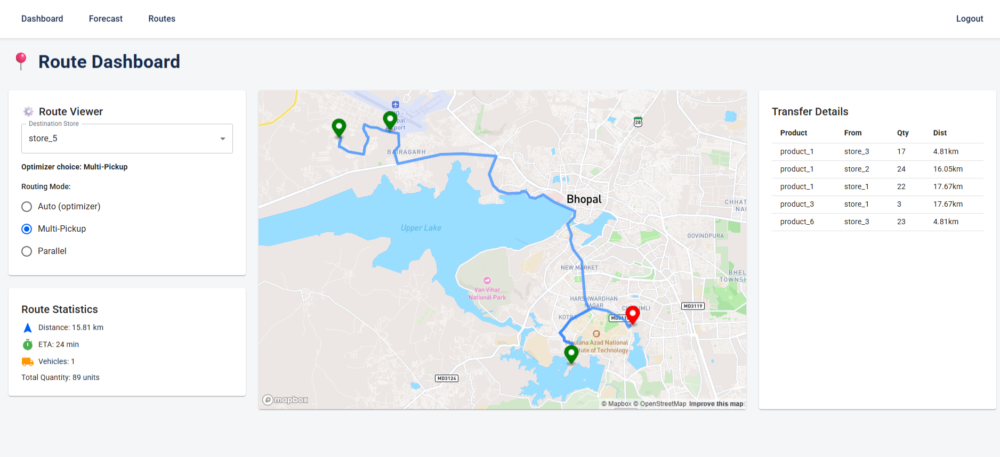

# 🧠 AI Stock Predictor & Retail Edge Platform

A full-stack AI platform for inventory forecasting, route optimization, and secure retail data exchange — powered by **FastAPI**, **Rust**, and **React**.

---

## 📌 Overview

This system predicts inventory demand for retail stores using AI, optimizes delivery routes, and facilitates secure, real-time communication between edge store devices and a central backend.

### Key Features:

- 🔮 AI-powered demand forecasts (7-day prediction window)
- 🚚 Smart delivery route optimization (single vs multi-truck logic)
- 📈 Interactive dashboard for stock, trends, and forecasts
- 🔐 Rust WebSocket Gateway with JWT authentication
- 📡 Real-time store updates with WebSockets

---

## 🧱 System Architecture

```txt
[ Retail Store Devices ]
        │
        ▼
[ Rust Gateway ] ← WebSocket + JWT Auth
        │
        ▼
[ FastAPI Backend ] ← Forecasting + Routing + APIs
        │
        ▼
[ React Frontend ] ← Dashboards + Charts + Maps
```

## 💻 Technologies Used

| Layer         |             Stack & Tools                    |
|---------------|----------------------------------------------|
| Frontend      | React.js, Chart.js, Mapbox, Folium           |
| Backend       | FastAPI, Python, Pandas                      |
| Edge Gateway  | Rust, Axum, Tokio, Serde, JWT, WebSocket     |
| Visualization | Mapbox, Folium, Chart.js                     |
| Data Handling | CSV-based data for predictions and locations |


## 📂 Project Structure
ai-stock-predictor/
├── rust-gateway/             # Rust-based WebSocket + auth gateway
├── frontend/                 # React frontend
│   └── src/
│       ├── App.js
│       ├── Dashboard.js
│       ├── Forecast.js
│       └── MapRoute.js
├── src/                      # FastAPI backend
│   ├── serve_api.py
│   └── generate_sample_data.py
├── data/                     # Input CSVs (inventory, locations)
├── outputs/                  # AI-generated forecasts
└── README.md

## 🔌 Backend (FastAPI)
📁 Located in /src

The FastAPI backend reads inventory/location data from data/, performs AI-based predictions, and writes results to outputs/.

API Endpoints:
- POST /predict: Predicts 7-day product demand for a store

- GET /dashboard: Returns store/product stats + alerts

- GET /route-data/{destination}: Returns optimized truck routes

- GET /stores and GET /products: Lists for dropdowns

Routing Modes:
- Multi-pickup: One truck visits multiple stores (farthest-first)

- Parallel: Multiple trucks dispatched to one destination

- ✅ Selection logic based on 2-hour time difference between modes

## 🔐 Rust Edge Gateway
📁 Located in /rust-gateway

The Rust-based gateway acts as a secure communication bridge between edge retail devices and the backend.

Responsibilities:
- WebSocket connections from in-store devices

- JWT-based client authentication

- Forwarding inventory data to FastAPI backend

- Useful for real-time sync between edge and cloud
  
## 🌐 Frontend (React)
📁 Located in /frontend

The React-based frontend provides an interactive dashboard to explore AI predictions, inventory trends, and delivery routes.

Pages:
- Dashboard: Summary tiles + alerts

- Forecast: Pick store/product → get 7-day trend chart

- Routes: Interactive delivery map using Mapbox/Folium
## 🧪 Local Setup
1. Backend (FastAPI)
  cd src
  pip install fastapi uvicorn pandas pyngrok
  uvicorn serve_api:app --reload
2. Frontend (React)
  cd frontend
  npm install
  npm start
3. Rust Gateway
  cd rust-gateway
  cargo build
  cargo run
Then open the app at:
🔗 http://localhost:3000

## 📷 Screenshots





